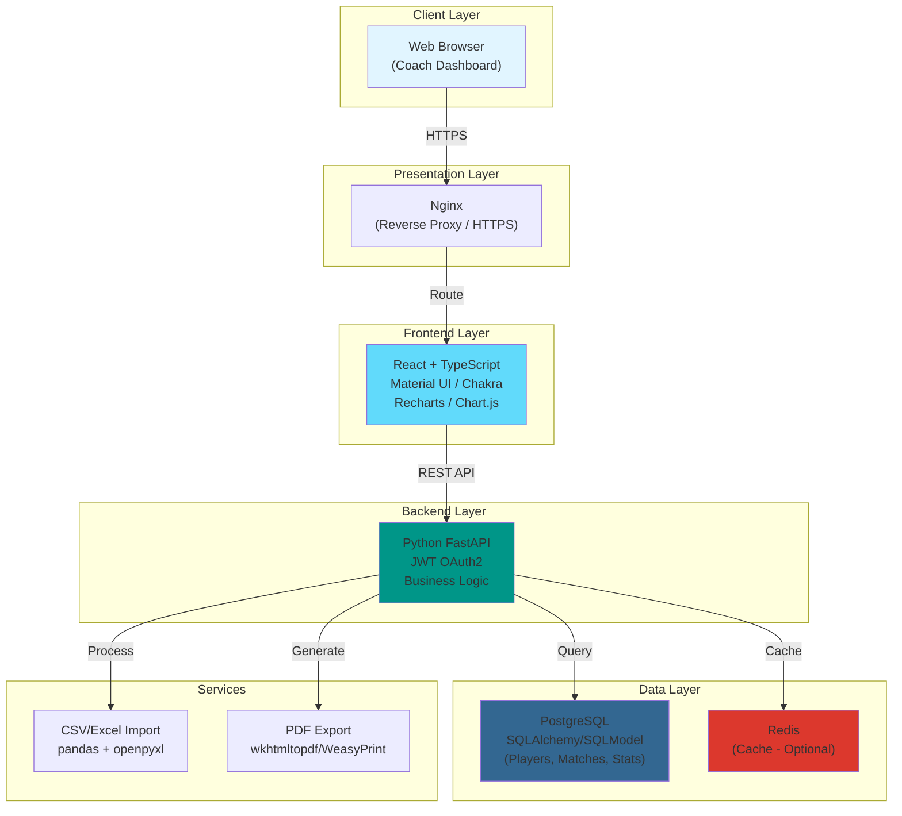
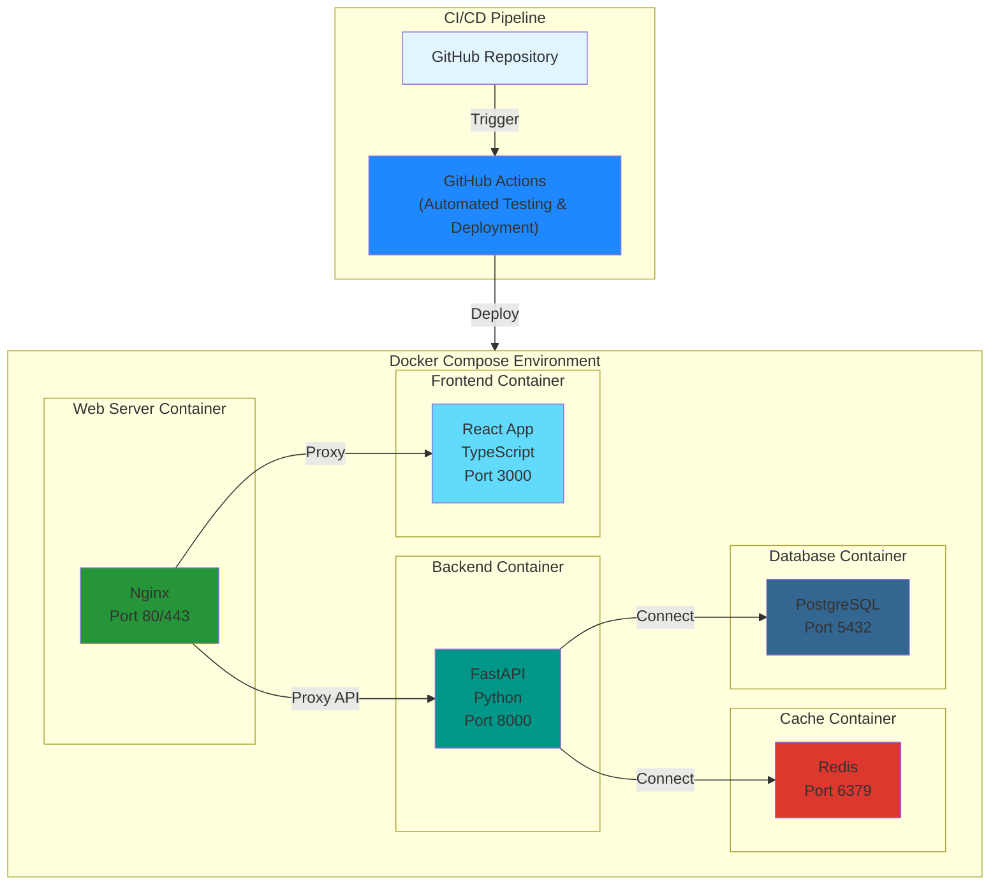
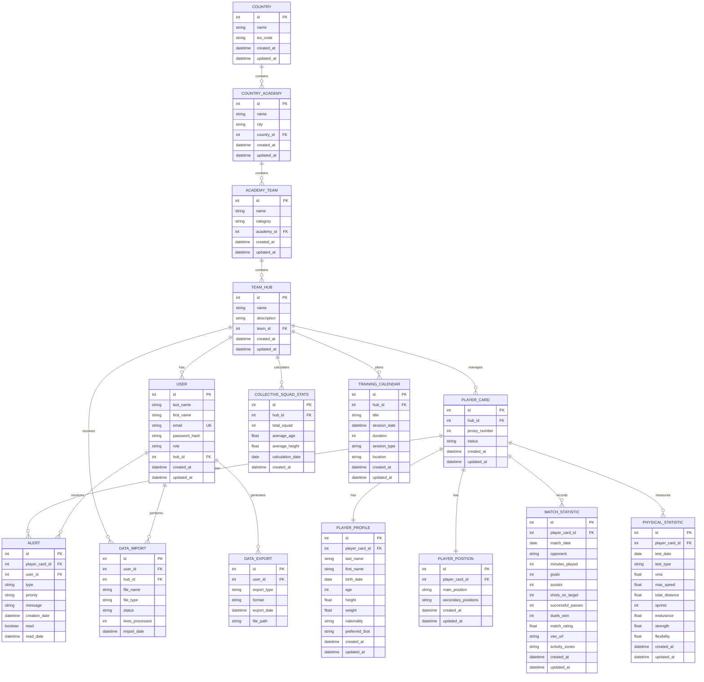
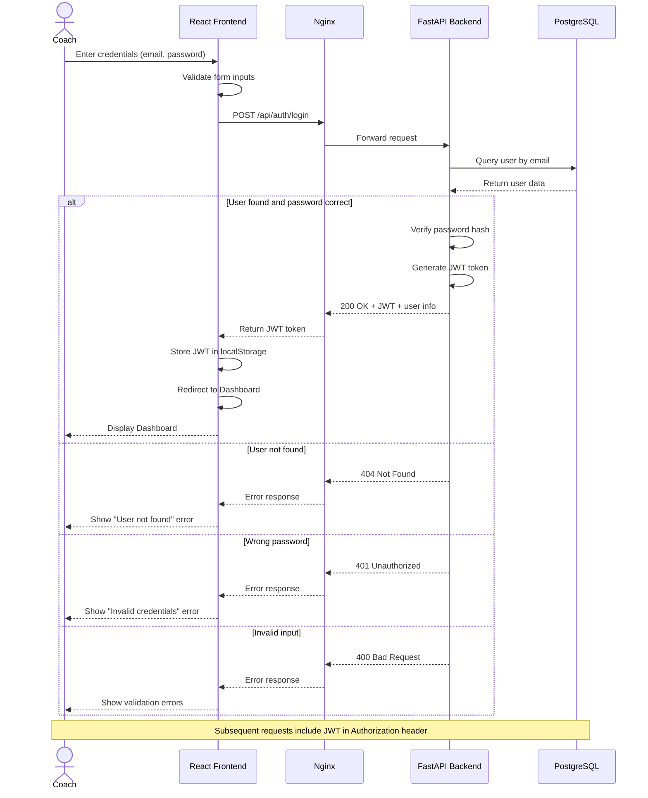
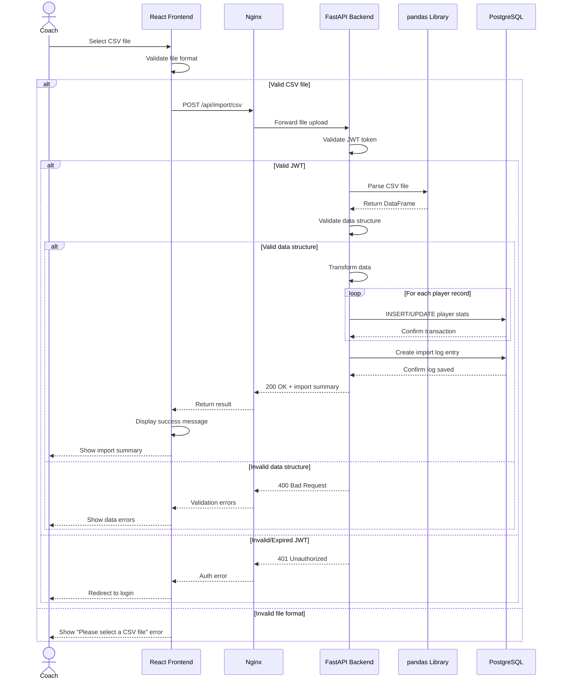
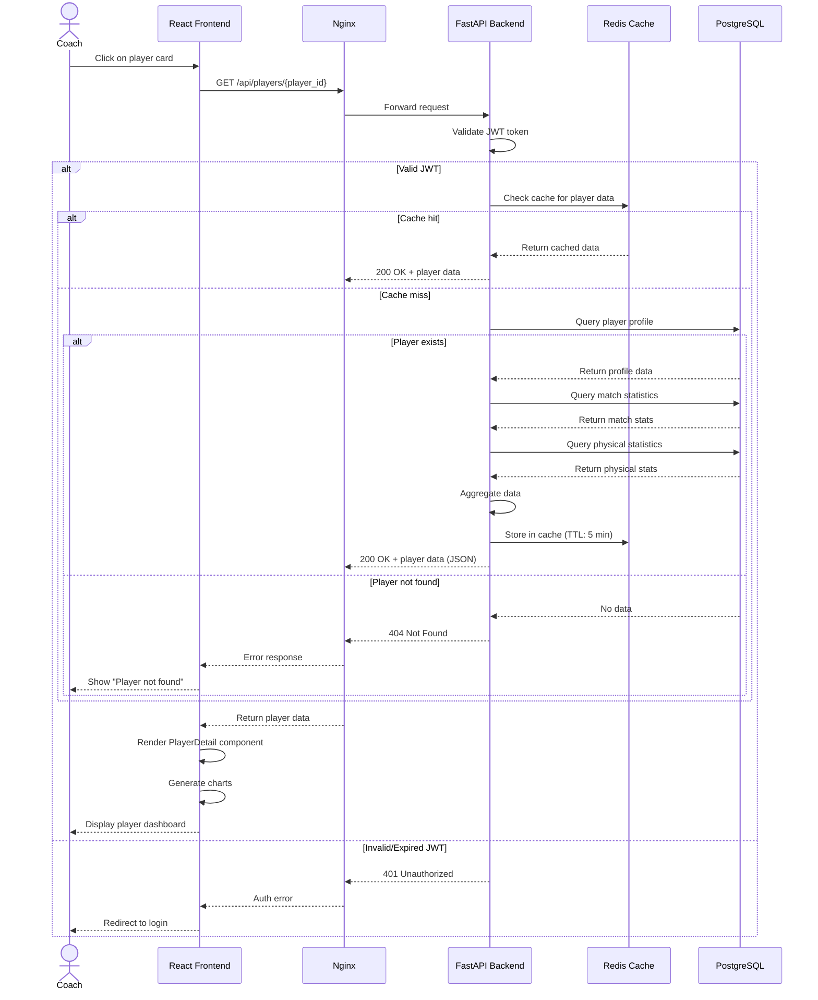

<div align="center"></div>

<div align="center">

# Portfolio-Project
</div>

## Summary
This portfolio project showcases my skills and achievements in software development through various projects completed during my training. It highlights my technical expertise, organizational abilities, and capacity to successfully carry out IT projects.

## 📚 Table of Contents

Stage 1
- [Team Formation and roles definition](#team-Formation-and-roles-definition)
- [Brainstorming and idea evaluation](#brainstorming-and-idea-evaluation)
- [Decision and Refinement](#decision-and-refinement)

Stage 2
- [High-Level Project Plan](#high-level-project-plan)

Stage 3
- [User Stories and Mockups](#user-stories-and-mockups)
- [System Architecture](#system-architecture)
- [Components, Classes, and Database Design](#components-classes-and-database-design)
- [High-Level Sequence Diagrams](#high-level-sequence-diagrams)
- [External and Internal APIs](#external-and-internal-apis)
- [SCM and QA Strategies](#scm-and-qa-strategies)

About
- [Author](#author)

---

# Stage 1/ Team Formation, Brainstorming and MVP.

## [Team Formation and roles definition](#-table-of-contents)
Our team began by getting to know each member’s background, strengths, and interests. We assigned initial responsibilities, including a temporary Project Manager to guide the early stages. Communication and collaboration guidelines were set up using tools like Slack or Discord. Each member took on a technical role—such as UI designer, backend developer, or frontend developer—based on their skills and preferences, ensuring balanced coverage of project needs. Stakeholders were identified and their influence on the project clarified where relevant.

The team is made up of four members:
- Pierre-Yves, who is specializing in cybersecurity.
- Jules, who is also specializing in cybersecurity.
- Valentin, who is in the first quarter of the fundamentals track.
- Loïc, who is in the third quarter of the fundamentals track.

At the start, we held a meeting to introduce ourselves, discuss our skills, and set expectations. We agreed to work as co-developers, without assigning a permanent Project Manager, but one member coordinates meetings and deadlines when needed.

We established communication norms: regular in-person meetings at school, a Discord group for technical discussions, and WhatsApp for client communication. Decisions are made collectively, with everyone’s input considered.

Technical roles were distributed based on project needs and individual strengths. The project is divided into three main parts, each managed by Pierre-Yves, Jules, or Loïc, who handle both front-end and back-end tasks. Valentin acts as the data analyst for the parts managed by Pierre-Yves and Jules, while Loïc also manages data for his section to prepare for demo day.

The direct stakeholders are obviously the co-developers, therefore Pierre-Yves, Jules, Valentin, and myself.
The indirect stakeholders are the clients :
- Pierre, who is the financial director.
- Florian, who is a goalkeepers’ coach.
- Sebastien, who is an assistant coach.
- Lucas, who is a fitness coach.

## [Brainstorming and idea evaluation](#-table-of-contents)
You need to research project ideas, organize a brainstorming session using techniques such as mind mapping, SCAMPER, and “How Might We” questions. Then you must define criteria to evaluate the ideas, write a list of ideas with a short description for each one, and finally rank these ideas based on their feasibility, risks, and impact.


To identify our project direction, we first researched current industry trends and real-world challenges in sports analytics and team management. Each team member contributed ideas inspired by personal interests and client needs.

We organized a brainstorming session using mind mapping and “How Might We” questions to generate and connect ideas. We also applied the SCAMPER framework to explore how existing solutions could be improved or adapted.

**Evaluation Criteria:**
- Feasibility (can we build it with our skills and resources?)
- Potential impact (usefulness for users and stakeholders)
- Technical alignment (matches our expertise)
- Scalability (can the solution grow or be adapted?)

**Project Ideas:**
1. **Player Performance Dashboard**  
   A web app to track and visualize player statistics, training progress, and match performance.
2. **Team Communication Platform**  
   A tool for coaches and players to share updates, schedules, and feedback.
3. **Fitness & Injury Tracker**  
   An application to monitor player fitness levels and injury recovery, with alerts for coaches.

**Ranking:**
1. **Player Performance Dashboard**  
   - Feasibility: High  
   - Impact: High  
   - Risks: Manageable  
   - Chosen for its direct relevance to client needs and our technical strengths.
2. **Fitness & Injury Tracker**  
   - Feasibility: Medium  
   - Impact: Medium  
   - Risks: Data privacy, medical accuracy
3. **Team Communication Platform**  
   - Feasibility: High  
   - Impact: Medium  
   - Risks: Competes with existing solutions

After discussion, we selected the Player Performance Dashboard as our MVP due to its strong alignment with stakeholder needs and our team's expertise.

## [Decision and Refinement](#-table-of-contents)
You need to choose the final MVP idea, clearly explain the problem it solves, the solution it provides, the target users, and the type of application. You must also justify why you chose this idea, define 2 to 3 key features, specify what will be included or not included in the project, and identify the main risks along with how you will manage them.


### Selected MVP: Player Performance Dashboard

**Problem to solve:**  
Coaches and staff lack a centralized tool to track player progress, statistics, and fitness, making decision-making and training optimization more difficult.

**Solution provided:**  
A web application that visualizes and analyzes performance, training, and match data for each player, making it easier to monitor and improve both individual and team results.

**Target users:**  
Coaches, technical staff, players, and sports analysts.

**Type of application:**  
Web application accessible on computers and tablets.

**Why this idea?**  
This project directly addresses the needs expressed by our clients and leverages our team’s technical skills. It offers immediate value and impact, while other ideas were either too complex for the available timeframe or already covered by existing solutions.

**Key features and objectives:**
1. Visualization of individual and team statistics (SMART goal: allow coaches to access clear, personalized reports for each player).
2. Tracking training progress (SMART goal: generate progress charts for each player over a given period).
3. Alerts and notifications for outstanding performances or drops in form (SMART goal: automate alerts when key indicators change significantly).

**In-scope deliverables:**
- Interactive dashboard with data visualization.
- Import/export system for statistics.
- Alerts and notification module.

**Out-of-scope:**
- Advanced medical analysis or injury tracking.
- Internal messaging platform.
- Native mobile application.

**Risks and mitigation:**
- **Risk:** Lack of experience with some data visualization technologies.  
  **Mitigation:** Plan training sessions and use proven libraries.
- **Risk:** Difficulty collecting reliable data.  
  **Mitigation:** Work closely with clients to define clear data formats and sources.
- **Risk:** High workload for the team.  
  **Mitigation:** Prioritize essential features and schedule regular progress reviews.

---

# Stage 2/ Project Planning.

## [High-Level Project Plan](#-table-of-contents)

### Timeline and Phases

| Stage / Milestone                  | Target Date      | Key Deliverables / Description                          |
|------------------------------------|:----------------:|---------------------------------------------------------|
| 1. Idea Development                | December 14      | Team formation, brainstorming, MVP selection            |
| 2. Project Planning                | December 21      | High-level plan, timeline, roles and responsibilities   |
| 3. Technical Documentation         | January 04       | Complete technical documentation                        |
| 4. CSV Data Processing Complete    | January 10       | All raw data cleaned and ready for use                  |
| 5. Backend Implementation Complete | End of January   | Core backend features developed and tested              |
| 6. Frontend Implementation Complete| End of February  | User interface and dashboard ready                      |
| 7. MVP Ready                       | March 10         | Fully functional MVP for demo and client review         |
| 8. Project Closure                 | mid-March        | Final presentation, documentation, handover             |

This integrated timeline provides a clear overview of all major phases and milestones, helping the team track progress and meet key deadlines throughout the project.

---

# Stage 3/ Technical Documentation.

## [User Stories and Mockups](#-table-of-contents)

**User Stories (MoSCoW Prioritization):**

**Must Have:**
1. As a coach, I want to view individual player statistics on a dashboard, so that I can quickly assess their performance.
2. As a coach, I want to import CSV data files containing player statistics, so that I can update the dashboard with the latest information.
3. As a coach, I want to visualize player progress over time through charts and graphs, so that I can identify trends and areas for improvement.
4. As a data analyst, I want to filter and sort player data by various criteria (position, date, performance metrics), so that I can perform detailed analysis.

**Should Have:**

5. As a coach, I want to receive alerts when a player's performance drops significantly, so that I can take corrective action quickly.
6. As a player, I want to view my own performance statistics, so that I can track my progress and set personal goals.
7. As a coach, I want to compare multiple players side-by-side, so that I can make informed decisions about team composition.

**Could Have:**

8. As a coach, I want to export customized reports in PDF format, so that I can share insights with management.
9. As a coach, I want to add notes and comments on individual player profiles, so that I can document observations and recommendations.

**Won't Have (for MVP):**

10. Advanced predictive analytics for future performance forecasting.
11. Mobile application version.
12. Integration with wearable fitness trackers.

**Mockups:**

[Here](images/mockups) is the link to the mockups.

## [System Architecture](#-table-of-contents)

### High-Level Architecture Diagram



### Deployment Architecture (Docker Compose)



### Components Description

**Front-end:**
- **Technology:** React + TypeScript
- **UI Library:** Material UI / Chakra UI / Mantine
- **Charts:** Recharts / Chart.js
- **Responsibilities:** Coach dashboard interface, data visualization, CSV file upload, player statistics display
- **Key Features:** Interactive charts, filtering, player comparison, responsive design

**Back-end:**
- **Technology:** Python + FastAPI
- **ORM:** SQLAlchemy / SQLModel
- **Authentication:** JWT (OAuth2 Password Flow)
- **Responsibilities:** REST API endpoints, business logic, authentication, data processing
- **Key Features:** 
  - CRUD operations for players, matches, and sessions
  - CSV/Excel import with pandas + openpyxl
  - User authentication and role management (coach, admin)
  - Performance alerts generation

**Database:**
- **Technology:** PostgreSQL
- **ORM:** SQLAlchemy / SQLModel
- **Responsibilities:** Store player data, match statistics, training sessions, user accounts
- **Structure:** Relational tables for players, matches, sessions, coaches, statistics

**Cache Layer (Optional for Performance):**
- **Technology:** Redis
- **Responsibilities:** Cache frequently accessed data to improve performance
- **Usage:** Store recent player statistics, dashboard data

**Import/Export:**
- **CSV/Excel Import:** pandas + openpyxl / csv module
- **PDF Export:** HTML + CSS + wkhtmltopdf / WeasyPrint for generating player reports and schedules

**Web Server:**
- **Technology:** Nginx
- **Responsibilities:** Reverse proxy, HTTPS, static file serving, load balancing
- **Features:** SSL/TLS termination, request routing, security

**Development & Deployment:**
- **Containerization:** Docker + Docker Compose
- **Version Control:** GitHub
- **CI/CD:** GitHub Actions for automated testing and deployment
- **Environment Consistency:** All team members work in identical Docker environments

**Future Enhancement:**
- **Mobile App:** React PWA (Progressive Web App) for players to view their own statistics

### Data Flow

1. **Coach uploads CSV file** → React frontend sends file to FastAPI backend
2. **Backend processes CSV** → pandas parses and validates data → stores in PostgreSQL via SQLAlchemy
3. **Coach requests dashboard** → React app calls FastAPI endpoints with JWT token
4. **Backend authenticates request** → Validates JWT → queries PostgreSQL (or Redis cache)
5. **Frontend renders charts** → Recharts/Chart.js displays player statistics
6. **Coach exports PDF report** → Backend generates PDF with wkhtmltopdf/WeasyPrint
7. **Performance alert** → Backend detects drop in statistics → triggers notification

### Architecture Justification

| Component | Technology | Justification |
|-----------|-----------|---------------|
| Backend API | Python + FastAPI | Versatile language, ideal for data manipulation; FastAPI is modern, fast, and simple to structure |
| Database | PostgreSQL | Reliable, performant, well-suited for relationships between players, matches, sessions |
| ORM | SQLAlchemy/SQLModel | Simplifies SQL queries, keeps code readable and maintainable |
| Frontend | React + TypeScript | Fluid, modern, reactive interface; TypeScript makes code safer and easier to maintain in teams |
| UI Components | Material UI/Chakra/Mantine | Ready-to-use components (tables, buttons, forms) to save development time |
| Charts | Recharts/Chart.js | Simple tools for displaying performance graphs and player statistics |
| Data Import | pandas + openpyxl | Easy import and transformation of stats files from external systems |
| Authentication | JWT (OAuth2) | Modern standard for securing connections and managing users (coach, admin, etc.) |
| PDF Export | wkhtmltopdf/WeasyPrint | Generates clean PDFs (reports, schedules) from application pages |
| Deployment | Docker Compose | Ensures all team members work in the same environment |
| Web Server | Nginx | Fast and secure production serving (HTTPS, redirects, etc.) |
| CI/CD | GitHub Actions | Facilitates collaborative work, backups, and automated deployments |
| Cache | Redis (optional) | Speeds up application by temporarily storing frequently requested data |
| Mobile (future) | React PWA | Reuses the same React codebase to create a simple mobile version for players |

## [Components, Classes, and Database Design](#-table-of-contents)

### Database Schema (PostgreSQL)


### Database Tables Description

**Main Tables:**

1. **COUNTRY**: Stores countries where academies are located
2. **COUNTRY_ACADEMY**: Football academies by country
3. **ACADEMY_TEAM**: Teams within an academy
4. **TEAM_HUB**: Management hub for each team
5. **USER**: System users (coaches, admins, analysts)
6. **PLAYER_CARD**: Central card grouping all player information
7. **PLAYER_PROFILE**: Player's personal information
8. **PLAYER_POSITION**: Player's positions on the field
9. **MATCH_STATISTIC**: Detailed stats per match
10. **PHYSICAL_STATISTIC**: Physical tests and athletic metrics
11. **ALERT**: Performance alerts for coaches
12. **COLLECTIVE_SQUAD_STATS**: Collective team statistics
13. **TRAINING_CALENDAR**: Training schedule
14. **DATA_IMPORT**: Data import history
15. **DATA_EXPORT**: Export history (PDF, CSV)

**Constraints and Indexes:**
- Primary Keys (PK) on all id columns
- Foreign Keys (FK) to maintain referential integrity
- Unique Key (UK) on user.email
- Indexes on frequently searched columns (match_date, test_date, player_card_id)
- Cascade delete on certain relationships (e.g., deleting a player_card deletes their stats)

### Frontend Components Architecture

**Main Pages:**
1. **HomePage** (1Home.png) - Dashboard overview with key statistics
2. **AcademiesPage** (2Academies.png) - List of academies
3. **TeamsPage** (3Teams.png) - List of teams
4. **PlayersPage** (4Players.png) - List of all players
5. **PlayerDetailPage** (5Player.png) - Individual player details
6. **ProfilePage** (6Profil.png) - Player profile information
7. **VEOPage** (7VEO.png) - VEO performance analysis
8. **CatapultPage** (8Catapult.png) - Catapult physical data
9. **SessionReportPage** (9Rapport de séance.png) - Training session report
10. **WeeklyReportPage** (10Rapport Hebdomadaire.png) - Weekly team report
11. **IndividualWeeklyReportPage** (11Rapport semaine individuel.png) - Individual weekly report

```
src/
├── components/
│   ├── layout/
│   │   ├── Header.tsx              # Header with navigation
│   │   ├── Sidebar.tsx             # Side navigation menu
│   │   └── Layout.tsx              # Main wrapper component
│   │
│   ├── auth/
│   │   ├── LoginForm.tsx           # Login form
│   │   └── ProtectedRoute.tsx     # Authentication-protected route
│   │
│   ├── dashboard/
│   │   ├── DashboardOverview.tsx   # Home dashboard (1Home.png)
│   │   └── StatCard.tsx            # Individual statistic card
│   │
│   ├── academies/
│   │   ├── AcademyList.tsx         # List of academies (2Academies.png)
│   │   └── AcademyCard.tsx         # Academy card component
│   │
│   ├── teams/
│   │   ├── TeamList.tsx            # List of teams (3Teams.png)
│   │   └── TeamCard.tsx            # Team card component
│   │
│   ├── players/
│   │   ├── PlayerList.tsx          # List of players (4Players.png)
│   │   ├── PlayerCard.tsx          # Player card component
│   │   ├── PlayerDetail.tsx        # Player detail view (5Player.png)
│   │   ├── PlayerProfile.tsx       # Player profile (6Profil.png)
│   │   └── PlayerFilter.tsx        # Search and filter component
│   │
│   ├── performance/
│   │   ├── VEOStats.tsx            # VEO performance data (7VEO.png)
│   │   ├── CatapultStats.tsx       # Catapult physical data (8Catapult.png)
│   │   ├── PerformanceChart.tsx    # Charts for performance visualization
│   │   └── ActivityZoneMap.tsx     # Activity zones display
│   │
│   ├── reports/
│   │   ├── SessionReport.tsx       # Training session report (9Rapport de séance.png)
│   │   ├── WeeklyReport.tsx        # Weekly team report (10Rapport Hebdomadaire.png)
│   │   ├── IndividualWeeklyReport.tsx # Individual weekly report (11Rapport semaine individuel.png)
│   │   └── ExportButtons.tsx       # PDF export buttons
│   │
│   ├── import-export/
│   │   ├── CSVImport.tsx           # CSV file upload
│   │   └── FileUploader.tsx        # Generic upload component
│   │
│   └── common/
│       ├── Button.tsx              # Custom button
│       ├── Table.tsx               # Generic table
│       ├── Loading.tsx             # Loading indicator
│       └── ErrorMessage.tsx        # Error message
│
├── pages/
│   ├── HomePage.tsx                # Dashboard (1Home.png)
│   ├── AcademiesPage.tsx           # Academies list (2Academies.png)
│   ├── TeamsPage.tsx               # Teams list (3Teams.png)
│   ├── PlayersPage.tsx             # Players list (4Players.png)
│   ├── PlayerDetailPage.tsx        # Player detail (5Player.png)
│   ├── ProfilePage.tsx             # Player profile (6Profil.png)
│   ├── VEOPage.tsx                 # VEO analysis (7VEO.png)
│   ├── CatapultPage.tsx            # Catapult data (8Catapult.png)
│   ├── SessionReportPage.tsx       # Session report (9Rapport de séance.png)
│   ├── WeeklyReportPage.tsx        # Weekly report (10Rapport Hebdomadaire.png)
│   ├── IndividualWeeklyReportPage.tsx # Individual report (11Rapport semaine individuel.png)
│   └── LoginPage.tsx               # Login page
│
├── hooks/
│   ├── useAuth.ts                  # Authentication hook
│   ├── usePlayers.ts               # Player management hook
│   ├── useStats.ts                 # Statistics retrieval hook
│   └── useApi.ts                   # Generic API call hook
│
├── services/
│   ├── api.ts                      # API client
│   ├── authService.ts              # Authentication service
│   ├── playerService.ts            # Player service
│   ├── statsService.ts             # Statistics service
│   ├── importService.ts            # CSV import service
│   └── exportService.ts            # PDF export service
│
└── types/
    ├── player.ts                   # Player types
    ├── stats.ts                    # Statistics types
    └── user.ts                     # User types
```

### Main Component Interactions

**Navigation Flow:**
1. `HomePage` → Overview dashboard
2. `AcademiesPage` → Select academy → `TeamsPage`
3. `TeamsPage` → Select team → `PlayersPage`
4. `PlayersPage` → Select player → `PlayerDetailPage`

**Player Detail Flow:**
1. `PlayerDetailPage` → Main player info (5Player.png)
2. Tabs/Navigation to:
   - `ProfilePage` → Personal info (6Profil.png)
   - `VEOPage` → Match performance (7VEO.png)
   - `CatapultPage` → Physical data (8Catapult.png)

**Reporting Flow:**
1. `SessionReportPage` → Training session analysis (9Rapport de séance.png)
2. `WeeklyReportPage` → Team weekly summary (10Rapport Hebdomadaire.png)
3. `IndividualWeeklyReportPage` → Player weekly summary (11Rapport semaine individuel.png)
4. Export buttons → Generate PDF reports

**Data Import:**
1. CSV import component → Upload player statistics
2. Backend processes → Updates database
3. Frontend refreshes → Displays updated data

## [High-Level Sequence Diagrams](#-table-of-contents)

### Use Case 1: User Authentication



### Use Case 2: CSV Data Import



### Use Case 3: View Player Performance Dashboard



### Sequence Diagrams Description

**1. User Authentication:**
- Coach enters credentials
- Frontend validates and sends to backend via Nginx
- Backend verifies credentials against database
- **Success case:** JWT token generated and returned to frontend, token stored for subsequent requests
- **Error cases:**
  - 404 Not Found: User doesn't exist
  - 401 Unauthorized: Wrong password
  - 400 Bad Request: Invalid input format

**2. CSV Data Import:**
- Coach uploads CSV file through frontend
- Frontend validates file format
- Backend receives and validates JWT token
- pandas library parses CSV data
- Data validated and transformed
- Each record inserted/updated in PostgreSQL
- Import log created for tracking
- **Success case:** Summary returned to coach with number of processed records
- **Error cases:**
  - 400 Bad Request: Invalid file format or data structure
  - 401 Unauthorized: Invalid or expired JWT token

**3. View Player Performance Dashboard:**
- Coach selects a player
- Backend validates JWT token
- Backend checks Redis cache first (performance optimization)
- If cache miss, queries PostgreSQL for all player data
- Data aggregated and cached for future requests
- Frontend receives data and renders dashboard with charts
- **Success case:** Coach views comprehensive player statistics
- **Error cases:**
  - 404 Not Found: Player doesn't exist
  - 401 Unauthorized: Invalid or expired JWT token

These sequence diagrams illustrate the main interactions between system components for critical MVP functionalities, including proper error handling and HTTP status codes.

## [External and Internal APIs](#-table-of-contents)

### External APIs

The project currently does not integrate external third-party APIs. All data processing is done internally using:

1. **pandas** - For CSV/Excel file parsing and data manipulation (internal library, not an external API)
2. **matplotlib/seaborn** - For data visualization and graph generation (internal library)

**Future Considerations:**
- **Email Service API** (e.g., SendGrid, Mailgun) - For sending performance alert notifications
- **Cloud Storage API** (e.g., AWS S3, Google Cloud Storage) - For storing uploaded files and generated reports
- **Authentication Provider** (e.g., Auth0, Firebase Auth) - For enhanced authentication management

### Internal API Endpoints

**Base URL:** `http://localhost:8000/api` (development) | `https://yourdomain.com/api` (production)

**Authentication:** JWT Bearer Token (for protected endpoints)

---

#### **Countries**

| Method | Endpoint | Description | Auth Required |
|--------|----------|-------------|---------------|
| POST | `/countries/` | Create a new country | Yes |
| GET | `/countries/` | Get all countries | Yes |
| PUT | `/countries/{country_id}` | Update a country | Yes |
| DELETE | `/countries/{country_id}` | Delete a country | Yes |

**POST /countries/**
```json
// Request
{
  "name": "France"
}

// Response (201 Created)
{
  "id": 1,
  "name": "France"
}
```

**GET /countries/**
```json
// Response (200 OK)
[
  {
    "id": 1,
    "name": "France"
  },
  {
    "id": 2,
    "name": "Spain"
  }
]
```

---

#### **Academies**

| Method | Endpoint | Description | Auth Required |
|--------|----------|-------------|---------------|
| POST | `/academies/` | Create a new academy | Yes |
| GET | `/academies/` | Get all academies | Yes |
| GET | `/academies/country/{country_id}` | Get academies by country | Yes |
| PUT | `/academies/{academy_id}` | Update an academy | Yes |
| DELETE | `/academies/{academy_id}` | Delete an academy | Yes |

**POST /academies/**
```json
// Request
{
  "name": "PSG Academy Paris",
  "country_id": 1
}

// Response (201 Created)
{
  "id": 1,
  "name": "PSG Academy Paris",
  "country_id": 1
}
```

**GET /academies/country/{country_id}**
```json
// Response (200 OK)
[
  {
    "id": 1,
    "name": "PSG Academy Paris",
    "country_id": 1
  },
  {
    "id": 2,
    "name": "PSG Academy Marseille",
    "country_id": 1
  }
]
```

---

#### **Teams**

| Method | Endpoint | Description | Auth Required |
|--------|----------|-------------|---------------|
| POST | `/teams/` | Create a new team | Yes |
| GET | `/teams/` | Get all teams | Yes |
| GET | `/teams/academy/{academy_id}` | Get teams by academy | Yes |
| PUT | `/teams/{team_id}` | Update a team | Yes |
| DELETE | `/teams/{team_id}` | Delete a team | Yes |

**POST /teams/**
```json
// Request
{
  "name": "U17 Team",
  "academy_id": 1
}

// Response (201 Created)
{
  "id": 1,
  "name": "U17 Team",
  "academy_id": 1
}
```

**GET /teams/academy/{academy_id}**
```json
// Response (200 OK)
[
  {
    "id": 1,
    "name": "U17 Team",
    "academy_id": 1
  },
  {
    "id": 2,
    "name": "U19 Team",
    "academy_id": 1
  }
]
```

---

#### **Players**

| Method | Endpoint | Description | Auth Required |
|--------|----------|-------------|---------------|
| POST | `/players/` | Create a new player | Yes |
| GET | `/players/` | Get all players | Yes |
| GET | `/players/team/{team_id}` | Get players by team | Yes |
| PUT | `/players/{player_id}` | Update a player | Yes |
| DELETE | `/players/{player_id}` | Delete a player | Yes |

**POST /players/**
```json
// Request
{
  "name": "Jean Dupont",
  "age": 17,
  "team_id": 1
}

// Response (201 Created)
{
  "id": 1,
  "name": "Jean Dupont",
  "age": 17,
  "team_id": 1
}
```

**GET /players/team/{team_id}**
```json
// Response (200 OK)
[
  {
    "id": 1,
    "name": "Jean Dupont",
    "age": 17,
    "team_id": 1
  },
  {
    "id": 2,
    "name": "Pierre Martin",
    "age": 16,
    "team_id": 1
  }
]
```

**PUT /players/{player_id}**
```json
// Request
{
  "name": "Jean Dupont",
  "age": 18
}

// Response (200 OK)
{
  "id": 1,
  "name": "Jean Dupont",
  "age": 18,
  "team_id": 1
}
```

---

#### **Catapult GPS Data**

| Method | Endpoint | Description | Auth Required |
|--------|----------|-------------|---------------|
| POST | `/catapult/upload` | Upload and process Catapult CSV file | Yes |
| GET | `/catapult/sessions` | Get all training sessions | Yes |
| GET | `/catapult/sessions/title/{session_title}` | Get sessions by title | Yes |
| GET | `/catapult/sessions/player/{player_name}` | Get sessions by player name | Yes |
| GET | `/catapult/sessions/{session_id}` | Get specific session by ID | Yes |
| POST | `/catapult/analyze/session/{session_title}` | Analyze session with split detection | Yes |

**POST /catapult/upload**
```
// Request (multipart/form-data)
Content-Type: multipart/form-data
file: [CSV file]

// Response (200 OK)
{
  "filename": "training_session_2024.csv",
  "records_stored": 25,
  "players_count": 25,
  "session_title": "Training Session - 2024-01-04",
  "summary": {
    "total_distance_avg": 5420.5,
    "max_speed_avg": 28.3,
    "sprint_count_avg": 12
  }
}
```

**GET /catapult/sessions**
```json
// Response (200 OK)
[
  {
    "id": 1,
    "session_title": "Training Session - 2024-01-04",
    "player_name": "Jean Dupont",
    "total_distance": 5420.5,
    "max_speed": 28.3,
    "sprint_count": 12,
    "high_speed_running": 850.2
  }
]
```

**POST /catapult/analyze/session/{session_title}**
```json
// Response (200 OK)
{
  "session_title": "Training Session - 2024-01-04",
  "analysis": {
    "splits_detected": 3,
    "split_summaries": [
      {
        "split_number": 1,
        "duration": "15:00",
        "avg_distance": 1800.5,
        "avg_intensity": "high"
      }
    ],
    "player_comparisons": [
      {
        "player": "Jean Dupont",
        "performance_score": 8.5,
        "rank": 1
      }
    ]
  }
}
```

---

### API Design Principles

**1. RESTful Design:**
- Resources are nouns (countries, academies, teams, players)
- HTTP methods match actions (GET=read, POST=create, PUT=update, DELETE=delete)
- Consistent URL structure

**2. Status Codes:**
- `200 OK` - Successful GET, PUT, DELETE
- `201 Created` - Successful POST
- `400 Bad Request` - Invalid input
- `401 Unauthorized` - Missing/invalid authentication
- `404 Not Found` - Resource doesn't exist
- `409 Conflict` - Duplicate resource (e.g., country name already exists)

**3. Response Format:**
- All responses are JSON
- Consistent error format:
```json
{
  "detail": "Error message description"
}
```

**4. Authentication:**
- Protected endpoints require JWT token in Authorization header:
```
Authorization: Bearer <token>
```

**5. Validation:**
- Input validation using Pydantic models
- Type checking enforced by FastAPI
- Automatic OpenAPI documentation at `/docs`

---

### Future API Endpoints (Planned)

| Method | Endpoint | Description |
|--------|----------|-------------|
| POST | `/auth/login` | User authentication |
| POST | `/auth/logout` | User logout |
| GET | `/auth/me` | Get current user info |
| GET | `/players/{player_id}/stats/match` | Get player match statistics |
| GET | `/players/{player_id}/stats/physical` | Get player physical statistics |
| POST | `/players/{player_id}/stats/match` | Add match statistics |
| POST | `/players/{player_id}/stats/physical` | Add physical test results |
| GET | `/players/{player_id}/performance-trend` | Get performance trend over time |
| GET | `/alerts/` | Get all alerts |
| GET | `/alerts/unread` | Get unread alerts |
| PATCH | `/alerts/{alert_id}/read` | Mark alert as read |
| POST | `/reports/session` | Generate session report PDF |
| POST | `/reports/weekly` | Generate weekly report PDF |
| POST | `/reports/individual` | Generate individual player report PDF |
| GET | `/calendar/sessions` | Get training calendar |
| POST | `/calendar/sessions` | Create training session |
| PUT | `/calendar/sessions/{session_id}` | Update training session |
| GET | `/calendar/export/pdf` | Export calendar as PDF |
| GET | `/calendar/export/ics` | Export calendar as ICS |

## [SCM and QA Strategies](#-table-of-contents)

### Source Control Management (SCM)

**Version Control:** Git + GitHub

**Branching Strategy:**
- `main` - Production-ready code (protected)
- `develop` - Integration branch for development
- `feature/*` - New features (e.g., `feature/player-dashboard`)
- `bugfix/*` - Bug fixes
- `hotfix/*` - Critical production fixes

**Workflow:**
1. Create feature branch from `develop`
2. Develop and commit regularly with clear messages
3. Push and create Pull Request to `develop`
4. Code review by at least 1 team member
5. Merge after approval and passing tests

**Commit Convention:**
```
feat: add new feature
fix: bug correction
docs: documentation update
test: add or update tests
```

**Code Review Requirements:**
- Minimum 1 approval
- All tests must pass
- No merge conflicts
- Code follows style guidelines

---

### Quality Assurance (QA)

**Testing Strategy:**

**1. Unit Tests**
- **Backend:** `pytest` (coverage target: 80%)
  - Test individual functions, parsers, models
- **Frontend:** `Jest` + `React Testing Library` (coverage target: 70%)
  - Test components, hooks, utilities

**2. Integration Tests**
- **Backend:** `pytest` + `TestClient` for API endpoints
- **Frontend:** `Cypress` for user flows and navigation

**3. Manual Testing**
- CSV import with various file sizes
- PDF report generation
- Chart visualizations
- Cross-browser compatibility (Chrome, Firefox, Safari)

**Testing Tools:**
| Layer | Frontend | Backend |
|-------|----------|---------|
| Unit | Jest | pytest |
| Integration | Cypress | pytest + TestClient |
| Linting | ESLint | pylint / black |

**CI/CD Pipeline (GitHub Actions):**
```
Pull Request → Automated Tests → Code Review → Merge
     ↓
develop branch → Deploy to Staging → Manual QA
     ↓
main branch → Deploy to Production
```

**Quality Metrics:**
- Code coverage: ≥80% backend, ≥70% frontend
- API response time: <200ms average
- All tests pass before deployment

**Environments:**
- **Development:** Local Docker containers
- **Staging:** Cloud deployment for testing
- **Production:** Live environment

---

## [Author](#-table-of-contents)

| Author           | Role      | GitHub                                   | Email                        |
|------------------|-----------|------------------------------------------|------------------------------|
| **Loïc Le Guen** | Co-developer | [@loicleguen](https://github.com/loicleguen) | 11510@holbertonstudents.com  |